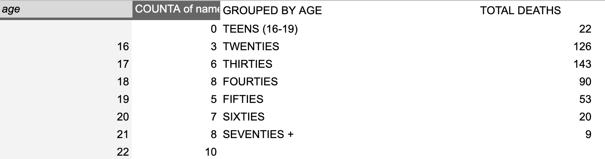
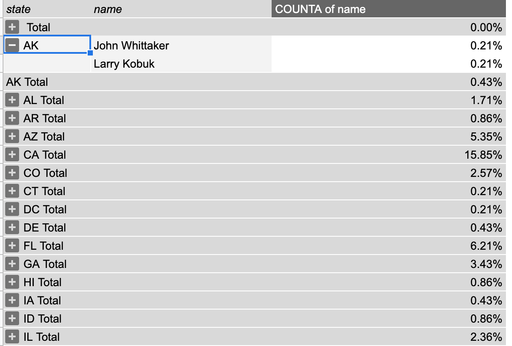

# FINAL PROJECT (DAKOTA BRUBAKER).


#### For this final project I chose to look at a FiveThirtyEight data set on police killings in 2015. 
#### Here is a link to the original article from [FiveThirtyEight](https://fivethirtyeight.com/features/where-police-have-killed-americans-in-2015/).


#### I chose this data set for two reasons:
1. Although the data set is slightly older knowing how to 
ask questions around a topic as relevant as police shootings is important. 
2. FiveThirtyEight is a reliable source for data with lots of information. 


#### The data set includes 468 recorded police killings in the United States from 2015. For each killing by police the CSV file gives information on: 
* **The victim** of police violence _(age, race, gender, name)_
* **Location** _(Long, Lat, City, State)_
* **Demographics** where violence occured _(data on the census track/city where the killing occured)_

As I first started looking at the data I had some initial questions: 
* What were the situations around these Americans being killed by the police? 
* Where was with violence against citizens happening? 
* Who was being affected by this? 

I started my investiation of the data by first using Google sheet filters to get a feel for what the age range of victims was, what was the highest and lowest medium income where violence occured, and what states appear most on the list. 
Just from my initial observations I noticed a few things:


1. That there seemed to be more 20 year olds than other ages 
2. CA appeared an impressive amount 

so I decided to start with this observation and make a pivot table for both. 

## DEATHS BY AGE 


The initial pivot table I created was for age of those killed. Here is the table: 





I then used a simple google sheet formula, ``` = SUM() ```, to group together the totals for teens, twenties, and on to a seventy + grouping. 


I then created a chart to really visualize what I had collected from the data. 

<iframe width="600" height="371" seamless frameborder="0" scrolling="no" src="https://docs.google.com/spreadsheets/d/e/2PACX-1vQw0hyjwUqtaHscofgS01TQXBX2abllsGuYY9bb-Dju2f1KHYEXRU_cXjuhTPh_IWsI7NRYz2tEzT5x/pubchart?oid=1943199288&amp;format=image"></iframe>


After seeing the graph I decided well it is interesting but not the best question I could ask for sure. So I investigated my other initial observation. 

I started by investigating the total percentage of killings by state by making a pivot table where I created rows for: 
1. **State**
2. **Name** 


Here is an image of my pivot table: 





I then used a values filter using ```= COUNTA() ``` for each state to find out what percentage of the total each state made up. 

The following is the graph I got from this process: 


## Percentage of Killings by State
This graph shows for each state what percentage of Americans killed by police occured in that state.


I saw from this graph that for the percentage for CA **(15.85%)** was actually the largest out of the entire US in 2015. From here I thought okay I can investigate one of my other questions about what is the socioeconomic situation around these killings in regards to CA. 

So from here I made a new sheet titled 'CA Median Income'. 

I ran into a notable probelm here though. To map by CA county I needed to use the counties code. Counties are given a FIPS code, for example a CA code may be 06001 (Alameda county). 

The problem I ran into is that the FiveThirtyEight data included CA with a missing digit (the zero in the first index), so the FIPS codes were 6001 for Alameda for example. This ended up being true for any FIPS code that began with a zero (states starting with A-C).
This happened because the data type for this column was numbers but numbers can't start with zero in google sheets so I changed the data type to plain text, which allowed me to add my zeros. 

I then using filters added all the states that had an incorrect FIPS code and fixed the problem. 


This allowed me to make the following maps: 


## CA COUNTIES BY MEDIAN INCOME 

Once I had the correct FIPS codes for CA I decided to further investigate by showing counties Median income where a killing occured. The FiveThirtyEight article had mentioned that there was a relationship between more impoverished census tracks and deaths so I figured I'd start with CA and see how this claim stood up to my knowledge of CA and the median income for these counties. 


I started this by creating this map on [DataWrapper](https://www.datawrapper.de/). 


<iframe title="CA COUNTIES" aria-label="map" id="datawrapper-chart-WsyMe" src="https://datawrapper.dwcdn.net/WsyMe/1/" scrolling="no" frameborder="0" style="width: 0; min-width: 100% !important; border: none;" height="748"></iframe><script type="text/javascript">!function(){"use strict";window.addEventListener("message",(function(a){if(void 0!==a.data["datawrapper-height"])for(var e in a.data["datawrapper-height"]){var t=document.getElementById("datawrapper-chart-"+e)||document.querySelector("iframe[src*='"+e+"']");t&&(t.style.height=a.data["datawrapper-height"][e]+"px")}}))}();
</script>


The map showed a clear lean towards killings happening in counties with a lower median income. The counties with higher income medians also pose the interesting question of is the median income actually a good indicaiton, for example LA county has a median income of roughly $68,000 but I imagine for many there income is much lower than $68,0000. 


After seeing the CA map I figured well this gives a pretty good visual aide for the idea that the state with the most police killings has these killings mostly occur within lower income counties so I decided to do the same for the entire country. 

## US COUNTIES BY MEDIAN INCOME


When I created this graph through datawrapper I decided to remove county and state boundries (leaving only counties where a citizen was killed by the police). I used median incomes by county again to try and showcase that across the country it is clear that many of these counties have a median income of near $40k. 


<iframe title="US COUNTIES WITH MEDIAN INCOME" aria-label="map" id="datawrapper-chart-PlgdB" src="https://datawrapper.dwcdn.net/PlgdB/1/" scrolling="no" frameborder="0" style="width: 0; min-width: 100% !important; border: none;" height="564"></iframe><script type="text/javascript">!function(){"use strict";window.addEventListener("message",(function(a){if(void 0!==a.data["datawrapper-height"])for(var e in a.data["datawrapper-height"]){var t=document.getElementById("datawrapper-chart-"+e)||document.querySelector("iframe[src*='"+e+"']");t&&(t.style.height=a.data["datawrapper-height"][e]+"px")}}))}();
</script>


After seeing this data I felt confident that if I were writing a story highlighting the counties where police killed people I would have the resources to show what demographic traits of these areas look like. 


After creating this map I decided well now I have a visualization of the counties but I should also create the option to show where exactly the killing happened, because a whole county being highlighted through a chloropleth map may be misleading about how widespread the deaths were. 

But I actually found the following map to drive home in some ways even better the idea that this is a serious issue within what we have normalized as 'policing'. 

For this map I used the longitude and latitude of each killing and used a pinpoint to show where the killing was and also a brief piece of information (through colorcoding) about if the American who was killed had a weapon on them or not. I chose to include this because you can see that a large portion of people who were killed had no form of weapon on them at all. 


## 2015 POLICE KILLINGS 


<iframe title="Police Killings (2015)" aria-label="map" id="datawrapper-chart-ewVqG" src="https://datawrapper.dwcdn.net/ewVqG/1/" scrolling="no" frameborder="0" style="width: 0; min-width: 100% !important; border: none;" height="677"></iframe><script type="text/javascript">!function(){"use strict";window.addEventListener("message",(function(a){if(void 0!==a.data["datawrapper-height"])for(var e in a.data["datawrapper-height"]){var t=document.getElementById("datawrapper-chart-"+e)||document.querySelector("iframe[src*='"+e+"']");t&&(t.style.height=a.data["datawrapper-height"][e]+"px")}}))}();
</script>


## CONCLUSIONS 

From working with the data some of my take aways are that: 
1. It's clear and not hard to find a correlation between low income counties adn geographic regions and more cases of police killings. 
2. I feel that many would assume that the worst states for police killing would be states with strong political and culture support for policing and a more militaristic police force but in fact liberal states tended to rank high on the list of killings. Now this isn't any type of conclusions but definetely could leaad to more questions and analyzation of budgeting and political contributions in liberal areas. 
3. Often victims of police killings were not armed in anyway and making this clear to the public is very maneagable with a data set like this. 
